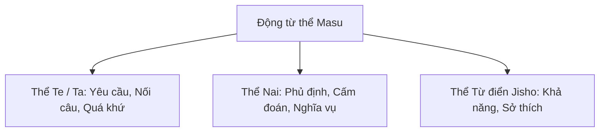

# 🔄 BẢNG TỔNG HỢP CÁCH CHIA CÁC THỂ ĐỘNG TỪ (N5 - N4)

> **Mục tiêu**: Nhìn bất kỳ động từ nào cũng có thể chia ngay sang các thể: **て (Te), ない (Nai), た (Ta), 辞書 (Từ điển)** trong 1 giây.

---

## 1. PHÂN BIỆT 3 NHÓM ĐỘNG TỪ

| Nhóm | Đặc điểm nhận diện | Ví dụ động từ |
| :---: | :--- | :--- |
| **Nhóm 1 (五段 - Godan)** | Trước `ます` là âm thuộc cột **-i-** (い, き, し, ち, に, ひ, み, り) | か**き**ます (viết), の**み**ます (uống), い**き**ます (đi) |
| **Nhóm 2 (一段 - Ichidan)** | • Trước `ます` là âm thuộc cột **-e-** (え, け, せ, て, ね, へ, め, れ) • *Một số động từ đặc biệt trước ます là cột -i-*: みます (xem), おきます (dậy), たります (đủ), かります (mượn)... | た**べ**ます (ăn), み**せ**ます (cho xem), **み**ます (xem) |
| **Nhóm 3 (Bất quy tắc)** | Gồm 2 động từ chính: **します (Làm)** và **きます (Đến)** (kèm các danh động từ như べんきょうします, けっこんします) | します (làm), きます (đến), さんぽします (đi dạo) |

---

## 2. BẢNG CÔNG THỨC CHIA CHI TIẾT

### A. Quy tắc chia Thể Te (て形) & Thể Ta (た形):
*(Chia thể Ta y hệt như thể Te, chỉ thay `て` thành `た`, `で` thành `だ`)*

- **Nhóm 1**:
  - `い, ち, り` -> **って** (かって, まって, とって)
  - `み, び, に` -> **んで** (のんで, あそんで, しんで)
  - `き` -> **いて** (かいて) *(Ngoại lệ: いきます -> **いって**)*
  - `ぎ` -> **いで** (いそいで)
  - `し` -> **して** (はなして)
- **Nhóm 2**: Bỏ `ます` thêm **て** (たべて, みて)
- **Nhóm 3**: 
  - します -> **して**
  - きます -> **きて**

### B. Quy tắc chia Thể Nai (ない形):
- **Nhóm 1**: Đổi âm trước `ます` từ cột **-i-** sang cột **-a-** rồi thêm **ない**.
  - かきます -> **かかない**
  - のみます -> **のまない**
  - *Lưu ý: đuôi `い` chuyển thành `わ`: あいます -> **あわない**.*
- **Nhóm 2**: Bỏ `ます` thêm **ない** (たべない, みない).
- **Nhóm 3**: 
  - します -> **しない**
  - きます -> **こない** (Phát âm là *konai*)

### C. Quy tắc chia Thể Từ điển (辞書形 - Jisho-kei):
- **Nhóm 1**: Đổi âm trước `ます` từ cột **-i-** sang cột **-u-**.
  - かきます -> **かく**
  - のみます -> **のむ**
  - いきます -> **いく**
- **Nhóm 2**: Bỏ `ます` thêm **る** (たべる, みる).
- **Nhóm 3**: 
  - します -> **する**
  - きます -> **くる**
