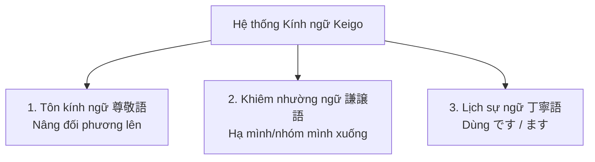

# 👑 CHUYÊN ĐỀ: TÔN KÍNH NGỮ & KHIÊM NHƯỜNG NGỮ (N4 - N3)

> **Mục tiêu**: Làm chủ 100% hệ thống Kính ngữ trong tiếng Nhật – chiếc chìa khóa sống còn trong môi trường công sở và đề thi JLPT.

---

## 1. TỔNG QUAN HỆ THỐNG KÍNH NGỮ (KEIGO 敬語)

---

## 2. BẢNG BIẾN ĐỔI ĐẶC BIỆT CỦA CÁC ĐỘNG TỪ THƯỜNG GẶP

| Động từ gốc | Ý nghĩa | Tôn kính ngữ (尊敬語 - Đối phương làm) | Khiêm nhường ngữ (謙譲語 - Mình làm) |
| :--- | :--- | :--- | :--- |
| **行きます** (Đi) | Đi | **いらっしゃいます / おいでになります** | **参ります (まいります)** |
| **来ます** (Đến) | Đến | **いらっしゃいます / おいでになります** | **参ります (まいります)** |
| **います** (Ở/Có) | Ở (người) | **いらっしゃいます** | **おります** |
| **食べます / 飲みます** | Ăn / Uống | **召し上がります (めしあがります)** | **いただきます** |
| **言います** (Nói) | Nói | **おっしゃいます** | **申します (もうします) / 申し上げます** |
| **見ます** (Xem/Nhìn) | Nhìn | **ご覧になります (ごらんになります)** | **拝見します (はいけんします)** |
| **聞きます / 行きます** | Nghe / Hỏi / Đến thăm | — | **伺います (うかがいます)** |
| **知っています** | Biết | **ご存じです (ごぞんじです)** | **存じております (ぞんじております)** |
| **します** (Làm) | Làm | **なさいます** | **いたします** |
| **会います** (Gặp) | Gặp gỡ | — | **お目にかかります** |

---

## 3. CÔNG THỨC CHUYỂN KÍNH NGỮ CHO ĐỘNG TỪ BÌNH THƯỜNG

### A. Tôn kính ngữ:
1. **Công thức 1**: `お + V(bỏ ます) + になります`
   - 先生は 本を **お読みに なります**。(Thầy giáo đọc sách.)
2. **Công thức 2**: `お + V(bỏ ます) + ください` (Yêu cầu lịch sự)
   - ここに お名前を **お書き ください**。(Xin vui lòng viết tên vào đây.)

### B. Khiêm nhường ngữ:
1. **Công thức**: `お + V(bỏ ます) + します / いたします`
   - 重い荷物を **お持ち します**。(Tôi xin phép xách hành lý giúp bạn.)
