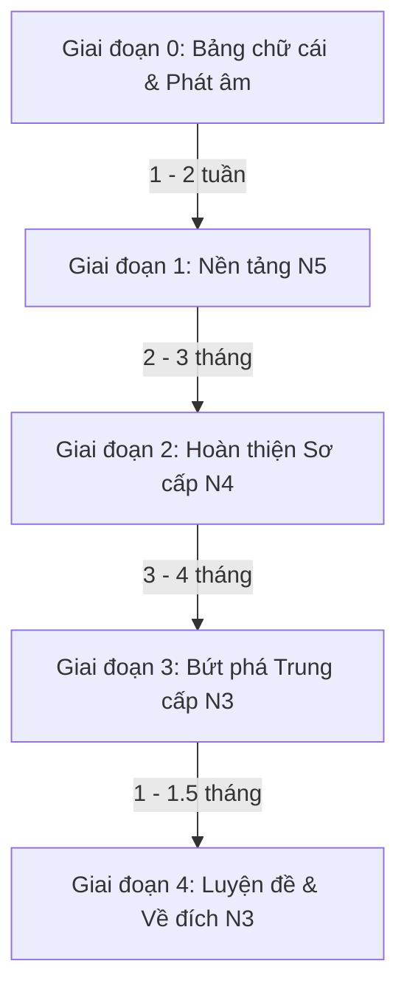

# 🇯🇵 LỘ TRÌNH & GIÁO TRÌNH HỌC TIẾNG NHẬT TỪ CON SỐ 0 ĐẾN JLPT N3

> **Thời gian dự kiến**: 9 – 12 tháng (Dành cho người tự học nghiêm túc từ 1.5 – 2.5 giờ/ngày)  
> **Mục tiêu**: Đạt chứng chỉ **JLPT N3**, làm chủ ~3.500 từ vựng, ~650 chữ Hán (Kanji), toàn bộ ngữ pháp sơ-trung cấp và khả năng giao tiếp, đọc hiểu công việc/đời sống cơ bản.

---

## 🧭 TỔNG QUAN CÁC GIAI ĐOẠN

---

## 📌 GIAI ĐOẠN 0: NHẬP MÔN & BẢNG CHỮ CÁI (Tuần 1 – 2)

### 🎯 Mục tiêu:
- Thuộc làu 2 bảng chữ cái: **Hiragana** (chữ mềm) và **Katakana** (chữ cứng).
- Nắm vững quy tắc âm đục, âm bán đục, âm ghép (ảo âm), trường âm, xúc âm (ngắt âm).
- Nắm cách phát âm và các câu chào hỏi giao tiếp căn bản.

### 📚 Tài liệu & Công cụ:
- **Giáo trình**: Bảng chữ cái chuẩn Minna no Nihongo hoặc giáo trình tự học Hiragana/Katakana.
- **Ứng dụng**: 
  - `Kana (Dr. Moku)` hoặc `HeyJapan` để học qua hình ảnh liên tưởng.
  - `Anki` / `Quizlet` để ôn tập phản xạ thẻ lật.
- **Video hỗ trợ**: Kênh Youtube Dũng Mori, Riki Nihongo, hoặc Nihongo no Mori (phần phát âm).

### 📝 Checklist hoàn thành:
- [ ] Viết đúng thứ tự nét và nhận diện toàn bộ 46 chữ cái Hiragana.
- [ ] Viết đúng và nhận diện toàn bộ 46 chữ cái Katakana.
- [ ] Đọc trôi chảy từ vựng có trường âm (おばあさん vs おばさん), âm ngắt (きって).
- [ ] Ghi nhớ các câu chào hỏi thông dụng (Ohayou, Konnichiwa, Arigatou, Sumimasen, Sayounara...).

---

## 📌 GIAI ĐOẠN 1: N5 – NỀN TẢNG SƠ CẤP 1 (Tháng 1 – Tháng 3)

### 🎯 Mục tiêu:
- **Từ vựng**: ~800 từ căn bản (đời sống, đồ vật, phương hướng, thời gian, hành động thường nhật).
- **Kanji (Hán tự)**: ~100 – 120 chữ cơ bản (Số đếm, ngày tháng, phương hướng, gia đình, động từ căn bản).
- **Ngữ pháp**: Nắm vững 25 bài đầu của giáo trình sơ cấp (Các trợ từ は, が, を, に, で, へ, と, も, から, まで; các thể động từ: ます, て, ない, た, Từ điển).

### 📚 Bộ giáo trình đề xuất:
1. **Ngữ pháp & Bài học chính**: 
   - *Minna no Nihongo I* (Bản dịch & Giải thích ngữ pháp tiếng Việt + Sách giáo khoa chính - Bài 1 đến 25).
2. **Từ vựng**: 
   - Cuốn *Minna no Nihongo I - Từ vựng & Giải thích ngữ pháp*.
3. **Kanji**: 
   - *Kanji Look and Learn* (Học 100 chữ đầu kèm hình ảnh minh họa và câu chuyện nhớ nhanh).
4. **Nghe hiểu & Đọc hiểu**: 
   - *Minna no Nihongo I - Choukai Tasuku 25* (Nghe hiểu).
   - *Minna no Nihongo I - Dokkai 25* (Đọc hiểu).

### 🗓️ Lộ trình chi tiết theo tuần (10 – 12 tuần):
- **Mỗi tuần**: Học 2 – 2.5 bài Minna no Nihongo + 10-15 chữ Kanji Look and Learn.
- **Quy trình 1 bài học**:
  1. *Ngày 1*: Nạp từ vựng của bài (nghe audio phát âm + flashcard Anki).
  2. *Ngày 2*: Học cấu trúc ngữ pháp (hiểu rõ ý nghĩa trợ từ và các mẫu câu).
  3. *Ngày 3*: Làm bài tập Renshuu B, C trong sách chính + Sách bài tập (Hyojun Mondaishu).
  4. *Ngày 4*: Luyện nghe (Choukai) và đọc bài đọc ngắn (Dokkai) của bài đó.

### 📝 Checklist hoàn thành N5:
- [ ] Nắm chắc cách chia các thể động từ sơ cấp: Thể Từ điển (Jisho), Thể Te, Thể Nai, Thể Ta.
- [ ] Tự giới thiệu bản thân, hỏi đường, mua sắm, gọi món, kể về lịch trình 1 ngày bằng tiếng Nhật.
- [ ] Làm thử 1 đề thi thử JLPT N5 đạt trên 100/180 điểm.

---

## 📌 GIAI ĐOẠN 2: N4 – HOÀN THIỆN TOÀN BỘ SƠ CẤP (Tháng 4 – Tháng 6)

### 🎯 Mục tiêu:
- **Từ vựng**: Tích lũy thêm ~700 – 800 từ (Tổng cộng đạt ~1.500 từ).
- **Kanji**: Tích lũy thêm ~180 – 200 chữ (Tổng cộng đạt ~300 – 350 chữ Hán).
- **Ngữ pháp**: Hoàn thành bài 26 đến 50 của Minna no Nihongo (Bao gồm: Thể Khả năng, Sai khiến, Bị động, Thể Điều kiện, Kính ngữ & Khiêm nhường ngữ sơ cấp, Nghe nói/Phỏng đoán).

### 📚 Bộ giáo trình đề xuất:
1. **Ngữ pháp & Bài học chính**: 
   - *Minna no Nihongo II* (Bài 26 đến 50).
2. **Kanji**: 
   - *Kanji Look and Learn* (Chữ số 101 đến 320).
3. **Luyện kỹ năng tổng hợp**:
   - Sách bài tập *Minna no Nihongo II*.
   - *Nihongo Soumatome N4* hoặc *Try! N4* (Dùng để tổng hợp và ôn luyện nhanh sau khi hết 50 bài Minna).

### 🔑 Trọng tâm ngữ pháp N4 cần làm chủ:
- Thể khả năng (`可能形` - Có thể làm gì).
- Thể ý định / ý chí (`意向形` - Rủ rê, dự định).
- Thể mệnh lệnh & Cấm chỉ (`命令形・禁止形`).
- Thể điều kiện (`〜たら, 〜ば, 〜なら, 〜と`).
- Thể bị động (`受身形`) & Thể sai khiến (`使役形`) & Sai khiến bị động.
- Kính ngữ (`尊敬語`) và Khiêm nhường ngữ (`謙譲語`).

### 📝 Checklist hoàn thành N4:
- [ ] Hoàn thành trọn vẹn 50 bài Minna no Nihongo.
- [ ] Đọc hiểu được các biển báo, thông báo thường nhật, email ngắn.
- [ ] Nghe hiểu các đoạn hội thoại thường nhật tốc độ vừa phải.
- [ ] Thi thử đề JLPT N4 đạt trên 110/180 điểm.

---

## 📌 GIAI ĐOẠN 3: N3 – TRUNG CẤP & BƯỚC NGOẶT BỨT PHÁ (Tháng 7 – Tháng 10)

> ⚠️ *Lưu ý quan trọng*: N3 là bước nhảy vọt lớn về khối lượng từ vựng, độ dài bài đọc và độ phức tạp của ngữ pháp so với N4. Cần đổi sang bộ giáo trình chuyên sâu theo kỹ năng.

### 🎯 Mục tiêu:
- **Từ vựng**: Tích lũy thêm ~1.800 – 2.000 từ (Tổng đạt ~3.500 từ vựng trung cấp).
- **Kanji**: Tích lũy thêm ~350 chữ (Tổng đạt ~650 – 700 chữ Hán, bao gồm cả từ ghép phức hợp).
- **Ngữ pháp**: ~130 – 150 mẫu ngữ pháp trung cấp (Phân biệt các mẫu tương đồng, ngữ pháp văn viết/văn nói).
- **Đọc hiểu & Nghe hiểu**: Đọc được các bài luận, tin tức ngắn; nghe hiểu hội thoại tự nhiên tốc độ thực tế.

### 📚 Bộ giáo trình chuyên biệt cho N3:

| Kỹ năng | Giáo trình chính | Giáo trình bổ trợ / Luyện tập |
| :--- | :--- | :--- |
| **Từ vựng (Goi)** | *Mimikara Oboeru N3 Goi* (Học qua câu ví dụ + Audio) | *Shinkanzen Master N3 Goi* / *Soumatome N3 Goi* |
| **Chữ Hán (Kanji)** | *Kanji Master N3* hoặc *Kanji Look and Learn N3* | Flashcard Anki (Bộ từ vựng kết hợp Kanji) |
| **Ngữ pháp (Bunpou)** | *Shinkanzen Master N3 Bunpou* (Giải thích chi tiết, bài tập sát đề thi thật) | *Try! N3* (Học ngữ pháp theo ngữ cảnh đoạn văn) |
| **Đọc hiểu (Dokkai)** | *Shinkanzen Master N3 Dokkai* | *Speed Master N3 Dokkai* / Báo *NHK News Web Easy* |
| **Nghe hiểu (Choukai)**| *Mimikara Oboeru N3 Choukai* | *Shinkanzen Master N3 Choukai* / Kênh *Nihongo con Teppei* |

### 🗓️ Phân chia tiến độ học N3 (14 – 16 tuần):

#### • Tuần 1 – 10: Nạp kiến thức (Input Phase)
- **Từ vựng**: Mỗi ngày 20-25 từ mới trong *Mimikara Oboeru N3* (kèm bật loa nghe mp3 lặp đi lặp lại).
- **Kanji**: Mỗi ngày 5-8 chữ Kanji mới + ôn tập chữ cũ qua app.
- **Ngữ pháp**: Mỗi ngày 2-3 mẫu ngữ pháp trong *Shinkanzen Master N3*, viết ví dụ thực tế cho từng mẫu.
- **Đọc hiểu & Nghe hiểu**: Xen kẽ cách ngày (1 ngày làm 2 bài đọc ngắn, 1 ngày làm 1 bài nghe hiểu).

#### • Tuần 11 – 14: Luyện kỹ năng Đọc - Nghe chuyên sâu (Deep Practice)
- Rèn luyện kỹ thuật làm bài đọc hiểu: Tìm từ khóa (Keyword), nắm ý chính tác giả, đọc quét thông tin (Scanning & Skimming).
- Luyện nghe Shadowing theo audio của Mimikara để tăng phản xạ tai và cơ miệng.

---

## 📌 GIAI ĐOẠN 4: LUYỆN ĐỀ & TỐI ƯU HÓA ĐIỂM SỐ JLPT N3 (Tháng 11 – Tháng 12)

### 🎯 Mục tiêu:
- Làm quen với áp lực thời gian phòng thi.
- Bịt các lỗ hổng kiến thức thường bẫy trong đề thi thật.
- Đạt mục tiêu điểm thi JLPT N3 từ **120+/180**.

### 📚 Tài liệu luyện đề:
- Tuyển tập đề thi chính thức JLPT N3 các năm gần nhất (Từ 2015 đến nay).
- Sách *JLPT Moshi N3 (Bộ 3 đề thi thử chuẩn format)*.
- Bộ đề thi *Goukaku Dekiru N3*.

### ⏱️ Chiến thuật luyện đề:
1. **Thi thử đúng giờ chuẩn**:
   - Kiến thức ngôn ngữ (Từ vựng/Chữ Hán + Ngữ pháp) & Đọc hiểu: Bấm giờ nghiêm túc 100 phút.
   - Nghe hiểu: 40 phút.
2. **Quy tắc phân tích đề (Post-mortem)**:
   - Dành thời gian sửa bài gấp 2 lần thời gian làm đề.
   - Ghi lại toàn bộ từ vựng mới, cấu trúc bẫy vào một cuốn sổ tay lỗi sai (`Mistake Notebook`).
   - Nghe lại bài nghe không nhìn script -> Nghe lại có script -> Nhại theo (Shadowing).

---

## ⚡ PHƯƠNG PHÁP HỌC & CÔNG CỤ TỐI ƯU HIỆU SUẤT

### 1. Kỹ thuật ghi nhớ (Spaced Repetition System - SRS):
- Cài đặt **Anki** trên điện thoại/máy tính. Tải sẵn deck: *Tango N5, N4, N3* hoặc *Mimikara N3*.
- Quẹt thẻ 15-20 phút mỗi ngày vào các khoảng thời gian chết (xe buýt, giờ giải lao, trước khi ngủ).

### 2. Kỹ thuật học Kanji theo Bộ thủ & Câu chuyện:
- Không chép cơ học 100 lần/chữ.
- Học cấu tạo chữ: 214 Bộ thủ căn bản -> Phân tích chữ Kanji thành các thành phần quen thuộc -> Tạo câu chuyện gợi nhớ.

### 3. Công cụ & Tiện ích hỗ trợ đắc lực:
- **Từ điển**: `Mazii` (Từ điển Nhật - Việt tốt nhất) hoặc `Jisho.org`.
- **Extension trình duyệt**: `Yomitan` (Rê chuột tra từ tức thì khi đọc báo, xem anime có sub).
- **Luyện đọc tin tức**: `TODAI Easy Japanese` / `NHK News Web Easy` (Có furigana trợ âm).
- **Luyện nghe thụ động & chủ động**: Podcast `Nihongo con Teppei`, Kênh Youtube `Japanese Ammo with Misa`, `Dogen` (Phát âm/Pitch Accent).

---

## ⏰ LỊCH BIỂU HỌC MẪU HẰNG NGÀY (2 GIỜ/NGÀY)

| Khung thời gian | Thời lượng | Nội dung thực hiện |
| :--- | :---: | :--- |
| **Buổi sáng** (hoặc thời gian rảnh) | 25 phút | Ôn tập Flashcard Anki (Từ vựng + Kanji). Nghe thụ động 1 bài podcast tiếng Nhật. |
| **Buổi tối - Phần 1** | 45 phút | Học kiến thức mới (Ngữ pháp bài mới hoặc 1 Unit từ vựng/Kanji). |
| **Buổi tối - Phần 2** | 30 phút | Làm bài tập thực hành trong sách (Sách bài tập hoặc bài tập Shinkanzen). |
| **Buổi tối - Phần 3** | 20 phút | Luyện Đọc 1 bài ngắn hoặc Luyện Nghe 2-3 câu hỏi + Shadowing. |

---

> 💡 **Lời khuyên từ meth**: 
> *"Học ngoại ngữ là cuộc chạy marathon, không phải chạy nước rút. 1 giờ mỗi ngày liên tục 365 ngày luôn mang lại kết quả vượt trội hơn việc học dồn 7 giờ vào cuối tuần. Hãy giữ vững ngọn lửa kỷ luật mỗi ngày!"*
