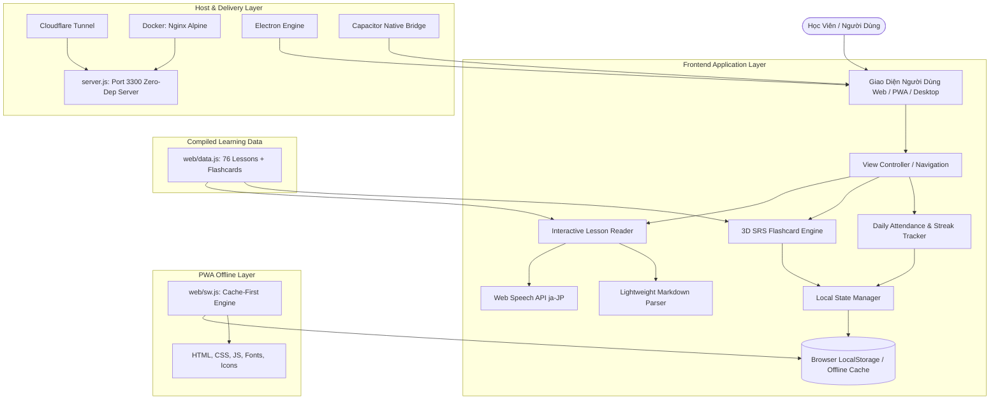

# 🏛️ Kiến Trúc Hệ Thống (System Architecture)

Tài liệu này mô tả chi tiết kiến trúc tổng thể, luồng dữ liệu, cơ chế hoạt động offline (PWA) và tích hợp đa nền tảng (Desktop/Mobile) của dự án **Nihongo Master**.

---

## 1. SƠ ĐỒ KIẾN TRÚC TỔNG THỂ (HIGH-LEVEL ARCHITECTURE)

---

## 2. CÁC TẦNG KIẾN TRÚC CHÍNH

### A. Tầng Dữ Liệu Học Tập (Data Bundle Layer - `web/data.js`)
- **Nguyên lý đóng gói**: Toàn bộ 76 file bài học Markdown được tiền biên dịch (pre-compiled) thành cấu trúc mảng JSON trong `web/data.js`.
- **Ưu điểm kiến trúc**:
  - Không cần gửi 76 request HTTP rời rạc về máy chủ khi chuyển bài học.
  - Tải tức thì (< 1ms) khi chuyển đổi giữa các bài học sơ cấp và trung cấp.
  - Hoạt động 100% khi không có kết nối Internet.

### B. Tầng Trình Bày & Xử Lý Logic (Frontend Client Layer)
- **Zero-Framework Overhead**: Sử dụng Vanilla JavaScript kết hợp CSS Custom Properties, không dùng React/Angular/Vue giúp dung lượng tải cực nhẹ (< 250KB toàn bộ app).
- **Bộ đọc Markdown (`parseMarkdown`)**: Bộ chuyển đổi Markdown tùy biến siêu nhanh, tự động format bảng biểu, tiêu đề, blockquote, danh sách công việc và inject nút loa phát âm **🔊**.
- **Web Speech API (`ja-JP`)**: Tận dụng engine tổng hợp giọng nói native của hệ điều hành (Windows SAPI, Apple Voice, Google TTS) để phát âm chuẩn mà không tốn băng thông tải file `.mp3`.

### C. Tầng Lưu Trữ Trạng Thái Cục Bộ (State Management & Storage)
- Toàn bộ dữ liệu điểm danh, chuỗi Streak, danh sách bài học đã hoàn thành và thẻ Flashcard đã thuộc được lưu tại `localStorage`:
  - `nihongo_attendance_dates`: Mảng ngày điểm danh `['YYYY-MM-DD', ...]`.
  - `nihongo_completed_lessons`: Mảng ID các bài học đã hoàn thành.
  - `nihongo_mastered_cards`: Mảng các từ vựng Flashcard đã thuộc.
  - `nihongo_theme_mode`: Trạng thái giao diện (`light` hoặc `dark`).
- **Data Portability**: Hỗ trợ xuất/nhập toàn bộ state thành file `.json` sao lưu.

### D. Tầng Cung Cấp & Triển Khai (Deployment & Runtime Layer)
1. **Node.js HTTP Server (`server.js`)**: Server thuần không phụ thuộc thư viện bên ngoài (`zero npm dependencies`), trang bị lớp bảo vệ Path Traversal Armor, Content Security Policy và Anti-DoS.
2. **Cloudflare Tunnel**: Mở đường hầm bảo mật từ máy chủ cục bộ (cổng `3300`) ra Internet có HTTPS tự động.
3. **Electron Desktop**: Đóng gói thành phần mềm Desktop cho Windows (`.exe`), macOS (`.dmg`), Linux (`.AppImage`).
4. **Capacitor Mobile**: Đóng gói thành ứng dụng di động cho Android (`.apk`) và iOS.
