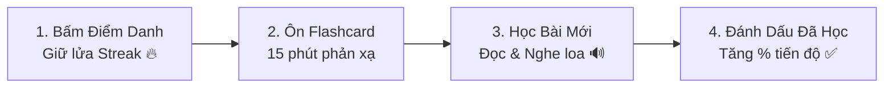

# 📖 Hướng Dẫn Sử Dụng Dành Cho Người Học (User Guide)

Chào mừng bạn đến với **Nihongo Master**! Cẩm nang này sẽ giúp bạn tận dụng tối đa các tính năng của nền tảng để đạt được chứng chỉ **JLPT N3** một cách nhanh chóng và vững chắc nhất.

---

## 🌟 1. LỘ TRÌNH 4 BƯỚC HỌC MỖI NGÀY

1. **Bước 1: Điểm danh đầu ngày**: Bấm nút **"✨ Điểm danh hôm nay"** để duy trì ngọn lửa kỷ luật và tích lũy chuỗi ngày học liên tục.
2. **Bước 2: Ôn tập Flashcard**: Vào mục **"🎴 Luyện Flashcard"**, lật thẻ phản xạ từ vựng và Kanji.
3. **Bước 3: Học bài mới**: Chọn bài học theo lộ trình (bắt đầu từ *Nhập môn* → *N5* → *N4* → *N3*), click vào biểu tượng loa **🔊** để nghe phát âm từng từ và câu ví dụ.
4. **Bước 4: Đánh dấu hoàn thành**: Sau khi làm bài tập, bấm **"⭕ Đánh dấu đã học"** để hệ thống tự động cộng % hoàn thành khóa học.

---

## 📲 2. CÁCH CÀI ĐẶT ỨNG DỤNG LÊN ĐIỆN THOẠI & MÁY TÍNH (PWA)

### Trên iPhone (Safari):
1. Mở trình duyệt Safari và truy cập vào đường link web của bạn.
2. Bấm vào biểu tượng **Chia sẻ (Share)** hình ô vuông có mũi tên trỏ lên ở thanh công cụ dưới cùng.
3. Cuộn xuống và chọn **"Thêm vào Màn hình chính" (Add to Home Screen)**.
4. Ứng dụng sẽ xuất hiện trên màn hình điện thoại giống hệt như một app tải từ App Store, hoạt động toàn màn hình và có thể học offline!

### Trên Android (Chrome):
1. Mở Google Chrome và truy cập đường link web.
2. Bấm nút **"📲 Cài Đặt App"** ở góc trên bên phải trang web hoặc bấm menu 3 chấm dọc → Chọn **"Cài đặt ứng dụng" (Install app)**.

### Trên Máy tính (Windows / macOS):
- Bấm vào biểu tượng cài đặt (màn hình máy tính có dấu mũi tên tải xuống) trên thanh địa chỉ của Chrome/Edge để cài app về máy.

---

## 💾 3. CÁCH SAO LƯU & KHÔI PHỤC TIẾN ĐỘ HỌC TẬP

Để tránh mất chuỗi ngày điểm danh và bài học đã hoàn thành khi đổi điện thoại hoặc xóa lịch sử duyệt web:

1. Bấm vào nút **"💾 Sao lưu & Khôi phục"** ở góc dưới thanh bên trái.
2. Bấm **"📥 Tải File Sao Lưu (.json)"** để lưu file tiến độ về máy.
3. Khi chuyển sang thiết bị mới, mở lại bảng này, chọn **"📤 Chọn File Khôi Phục"** và tải lên file `.json` vừa lưu. Toàn bộ tiến độ sẽ được phục hồi 100%!

---

## 🎯 4. BÍ QUYẾT LUYỆN NGHE & PHÁT ÂM (SHADOWING)
- Bất cứ khi nào bạn nhìn thấy biểu tượng loa **🔊** cạnh từ vựng hoặc câu ví dụ, hãy bấm nghe và **nhại lại to rõ ràng ngay lập tức** (phương pháp Shadowing).
- Việc lặp lại liên tục sẽ giúp cơ miệng và tai của bạn làm quen với ngữ điệu tự nhiên của người Nhật.
