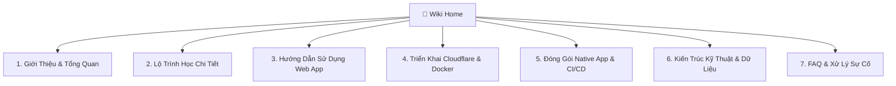

# 🌸 Chào Mừng Đến Với Wiki Nihongo Master

Chào mừng bạn đến với trung tâm kiến thức và tài liệu chính thức của **Nihongo Master** (Lộ trình & Nền tảng tự học tiếng Nhật từ 0 đến JLPT N3).

---

## 🧭 MỤC LỤC & ĐIỀU HƯỚNG WIKI (TABLE OF CONTENTS)



### 📚 1. Giới Thiệu & Lộ Trình Học
* 🇯🇵 **[01. Giới Thiệu & Tổng Quan Dự Án](01-Gioi-Thieu-Va-Tong-Quan.md)**: Triết lý thiết kế, đối tượng học viên và mục tiêu chinh phục N3 trong 9-12 tháng.
* 🗺️ **[02. Lộ Trình Học Tập Chi Tiết](02-Lo-Trinh-Hoc-Tap-Chi-Tiet.md)**: Bóc tách 76 bài học từ Bảng chữ cái, Minna no Nihongo I-II đến Shinkanzen Master N3.

### 📱 2. Hướng Dẫn Sử Dụng & Trải Nghiệm
* 📖 **[03. Hướng Dẫn Sử Dụng Web App & PWA](03-Huong-Dan-Su-Dung-Web-App.md)**: Hướng dẫn điểm danh hàng ngày, giữ chuỗi Streak 🔥, luyện Flashcard 3D bằng phím tắt và sao lưu JSON.

### 🚀 3. Triển Khai & Vận Hành (DevOps)
* ☁️ **[04. Triển Khai Cloudflare Tunnel & Docker](04-Trien-Khai-Cloudflare-Tunnel-Va-Docker.md)**: Hướng dẫn đưa Web App lên Internet miễn phí, bảo mật HTTPS tự động không cần mở port modem.
* 📦 **[05. Đóng Gói Native App & CI/CD](05-Dong-Goi-Va-Phat-Hanh-App.md)**: Cách build file cài đặt Windows (`.exe`), macOS (`.dmg`), Linux (`.AppImage`) và Android (`.apk`).

### ⚙️ 4. Kỹ Thuật & Hỗ Trợ
* 🏛️ **[06. Kiến Trúc Kỹ Thuật & Cấu Trúc Dữ Liệu](06-Kien-Truc-Ky-Thuat-Va-API.md)**: Phân tích kiến trúc Zero-Dependency, Web Speech API, Service Worker Cache-First và Schema dữ liệu.
* ❓ **[07. Câu Hỏi Thường Gặp & Khắc Phục Sự Cố (FAQ)](07-FAQ-Va-Xu-Ly-Su-Co.md)**: Giải đáp thắc mắc về âm thanh giọng đọc, lỗi bộ nhớ đệm và hướng xử lý.

---

## ⚡ BẮT ĐẦU NHANH (QUICKSTART)

1. **Khởi chạy ứng dụng ngay tại máy:**
   ```bash
   git clone https://github.com/methanol-dev/nihongo-master.git
   cd nihongo-master
   npm start
   ```
2. **Truy cập vào trình duyệt:** `http://localhost:3300`
